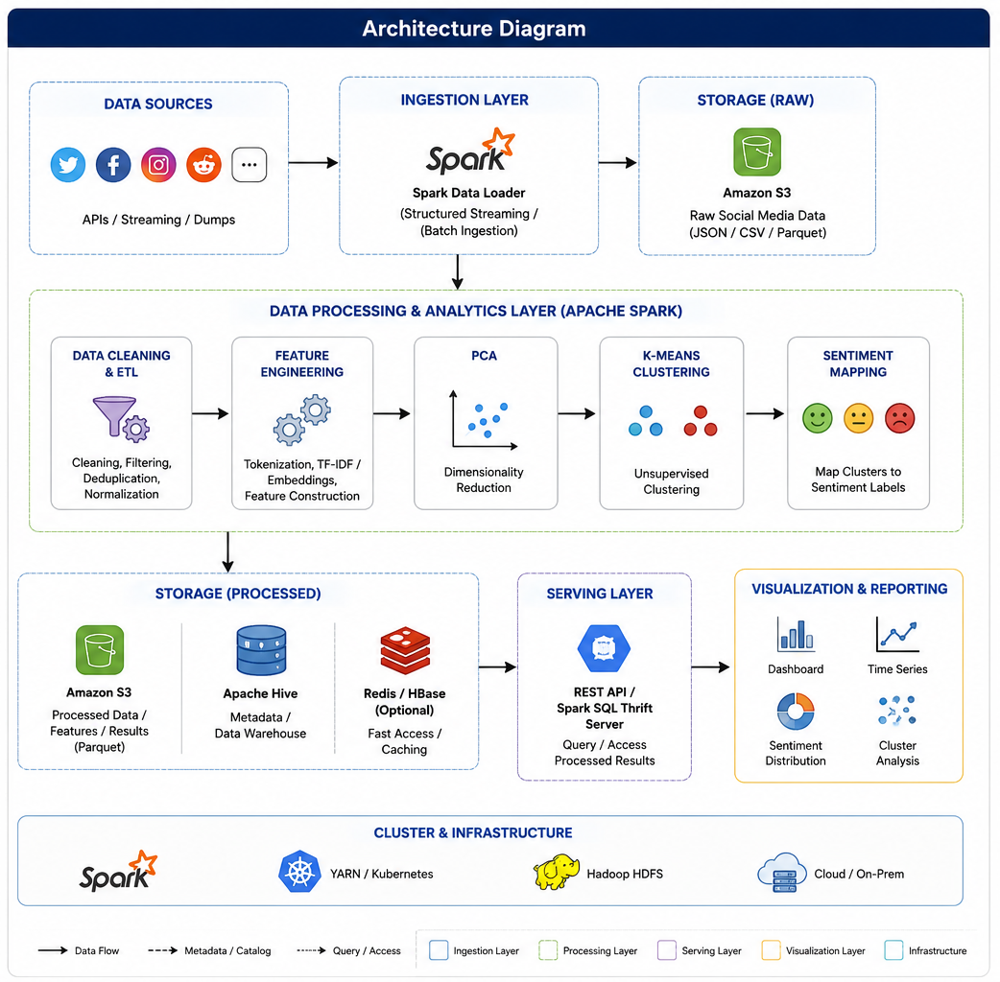
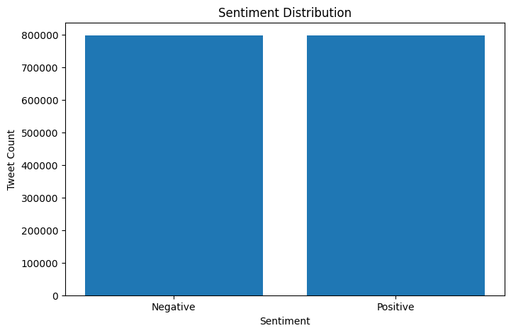
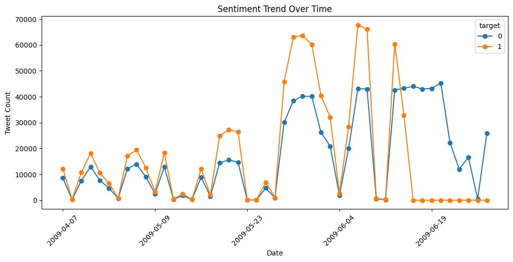
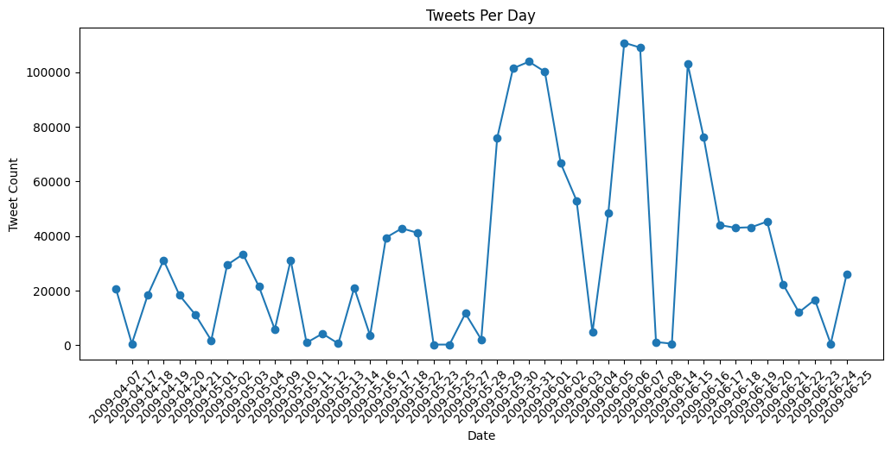
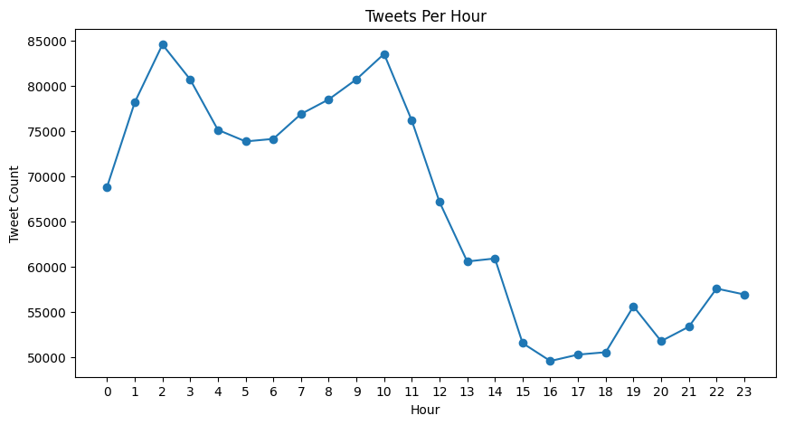

# Social Media Analysis Pipeline
### Distributed Sentiment Analytics & Clustering Using Apache Spark

[]()

[]()

[]()

---
## Overview

Social Media Analysis Pipeline is an end-to-end data engineering and machine learning project designed to process and analyze large-scale social media datasets using distributed computing.

The system leverages Apache Spark for scalable data processing, Principal Component Analysis (PCA) for dimensionality reduction, and K-Means clustering to identify patterns and sentiment-driven communities within social media conversations.

The project demonstrates practical applications of:

- Distributed Data Processing
- ETL Pipeline Design
- Machine Learning Workflows
- Large-Scale Text Analytics
- Data Visualization & Reporting

---
## Business Problem

Organizations receive massive volumes of customer feedback through social media platforms every day. Extracting meaningful insights from millions of posts manually is impossible.

This project addresses that challenge by:

- Processing large-scale tweet datasets efficiently
- Grouping similar conversations automatically
- Identifying dominant sentiment patterns
- Generating visual reports for decision-makers
- Providing a scalable foundation for future real-time analytics

---
## Key Features

### Scalable Data Processing

- Distributed data ingestion using Apache Spark
- Optimized preprocessing for large datasets
- Modular ETL architecture

### Machine Learning Pipeline

- Feature engineering and text transformation
- PCA-based dimensionality reduction
- K-Means clustering for pattern discovery
- Sentiment mapping and cluster analysis

### Analytics & Reporting

- Automated sentiment distribution reports
- Cluster performance metrics
- Trend identification
- Visualization-ready outputs

### Maintainability

- Modular code structure
- Separation of concerns
- Reusable processing components
- Easily extensible architecture

---
## System Architecture

### High-Level Data Flow

<<<<<<< HEAD


### Architecture Diagram


=======
```text

Raw Social Media Dataset
            │
            ▼
     Spark Data Loader
            │
            ▼
   Data Cleaning & ETL
            │
            ▼
   Feature Engineering
            │
            ▼
           PCA
            │
            ▼
      K-Means Clustering
            │
            ▼
    Sentiment Mapping
            │
            ▼
 Reporting & Visualization

````

### Architecture Diagram

> Placeholder: Insert architecture diagram here

```markdown


```
>>>>>>> 90263e9788b916fe9e411fbb54ce52ba1156eed3

---
## Technology Stack

| Category                 | Technologies        |
| ------------------------ | ------------------- |
| Language                 | Python 3.x          |
| Distributed Processing   | Apache Spark        |
| Machine Learning         | Scikit-Learn        |
| Dimensionality Reduction | PCA                 |
| Clustering               | K-Means             |
| Visualization            | Matplotlib, Seaborn |
| Data Handling            | Pandas, NumPy       |

---
## Dataset

### Source

<<<<<<< HEAD
[Sentiment140 Dataset Link](https://www.kaggle.com/datasets/kazanova/sentiment140)
=======
Sentiment140 Dataset

> Placeholder: Add dataset source link
>>>>>>> 90263e9788b916fe9e411fbb54ce52ba1156eed3

### Dataset Characteristics

| Attribute     | Value                |
| ------------- | -------------------- |
<<<<<<< HEAD
| Total Records | 1,600,000            |
| Data Type     | Tweets               |
| Labels        | Sentiment Categories |
| Format        | CSV                  |
| Size          | 238.8 MB             |
| Columns       | 6                    |   

=======
| Total Records | [INSERT VALUE]       |
| Data Type     | Tweets               |
| Labels        | Sentiment Categories |
| Format        | CSV                  |
| Size          | [INSERT VALUE]       |
>>>>>>> 90263e9788b916fe9e411fbb54ce52ba1156eed3
### Sample Dataset

| Tweet                    | Sentiment |
| ------------------------ | --------- |
| "I love this product!"   | Positive  |
| "Worst experience ever." | Negative  |

---
## Project Structure

```text

Social-Media-Analysis/
│
├── dataset/
│   └── Raw datasets
│
├── exports/
│   └── Intermediate Spark outputs
│
<<<<<<< HEAD
├── outputs_full/
│   ├── clustered_full_dataset.csv
=======
├── outputs/
│   ├── clustered_full_dataset.csv
│   ├── dominant_sentiment_per_cluster.csv
│   └── visual reports
>>>>>>> 90263e9788b916fe9e411fbb54ce52ba1156eed3
│
├── script/
│   ├── main.py
│   ├── load_dataset.py
│   ├── spark_loader.py
│   ├── spark_preprocessing.py
│   ├── model.py
│   ├── dataAnalysis.py
│   └── dataVisualization.py
│
├── visual_ref/
│   └── Reference visualizations
│
├── requirements.txt
│
└── README.md

```

---
## Data Engineering Pipeline

### 1. Data Ingestion

**Module:** `spark_loader.py`

Responsibilities:

* Load large datasets efficiently
<<<<<<< HEAD
* Create Spark DataFrames
=======

* Create Spark DataFrames

>>>>>>> 90263e9788b916fe9e411fbb54ce52ba1156eed3
* Manage distributed data access

---
### 2. Data Cleaning & Preprocessing

**Module:** `spark_preprocessing.py`

Operations:

* Remove noise
<<<<<<< HEAD
* Handle missing values
* Normalize text
* Standardize formatting
=======

* Handle missing values

* Normalize text

* Standardize formatting

>>>>>>> 90263e9788b916fe9e411fbb54ce52ba1156eed3
* Prepare features for modeling

---
### 3. Feature Engineering

Examples:

* Tokenization
<<<<<<< HEAD
* Vectorization
* Numerical transformation
=======

* Vectorization

* Numerical transformation

>>>>>>> 90263e9788b916fe9e411fbb54ce52ba1156eed3
* Feature selection

---
## Machine Learning Workflow

### Dimensionality Reduction

Principal Component Analysis (PCA) is used to:

* Reduce feature dimensionality
<<<<<<< HEAD
* Improve computational efficiency
* Retain meaningful variance
=======

* Improve computational efficiency

* Retain meaningful variance

>>>>>>> 90263e9788b916fe9e411fbb54ce52ba1156eed3
* Improve clustering quality

### Clustering

K-Means clustering is applied to:

* Discover hidden patterns
<<<<<<< HEAD
* Group similar social media posts
=======

* Group similar social media posts

>>>>>>> 90263e9788b916fe9e411fbb54ce52ba1156eed3
* Identify behavioral and sentiment-based segments

### ML Workflow

<<<<<<< HEAD

=======
```text

Tweets
   │
   ▼
Preprocessing
   │
   ▼
Feature Engineering
   │
   ▼
  PCA
   │
   ▼
K-Means
   │
   ▼
Cluster Assignment
   │
   ▼
Sentiment Mapping

```
>>>>>>> 90263e9788b916fe9e411fbb54ce52ba1156eed3

---
## Analytics Layer

The analytics engine calculates:

* Cluster distributions
<<<<<<< HEAD
* Sentiment percentages
* Dominant cluster emotions
=======

* Sentiment percentages

* Dominant cluster emotions

>>>>>>> 90263e9788b916fe9e411fbb54ce52ba1156eed3
* Cluster-level statistics

### Metrics Table

<<<<<<< HEAD
| Metric                 | Value    |
| ---------------------- | -------- |
| Total Tweets Processed | 1,583,571|
| Number of Clusters     | 5        |
| PCA Components         | 2        |

| Cluster | Negative Count | Positive Count | Dominant Sentiment | % Majority |
|---------|-----------------|---------------|--------------------|------------|
| 0       | 233,563         | 174,434       | Negative           | 57.25%     |
| 1       | 186,196         | 161,169       | Negative           | 53.60%     |
| 2       | 103,965         | 126,361       | Positive           | 54.86%     |
| 3       | 86,032          | 115,075       | Positive           | 57.22%     |
| 4       | 184,522         | 212,254       | Positive           | 53.49%     |

=======
> Placeholder: Add actual project metrics

| Metric                 | Value    |
| ---------------------- | -------- |
| Total Tweets Processed | [INSERT] |
| Number of Clusters     | [INSERT] |
| PCA Components         | [INSERT] |
| Processing Time        | [INSERT] |
| Silhouette Score       | [INSERT] |
>>>>>>> 90263e9788b916fe9e411fbb54ce52ba1156eed3
---
## Results & Visualizations

### Sentiment Distribution

<<<<<<< HEAD


### Summary Dashboard




=======
> Placeholder

```markdown


```

### PCA Cluster Visualization

> Placeholder

```markdown


```

### Cluster Summary Dashboard

> Placeholder

```markdown


```
>>>>>>> 90263e9788b916fe9e411fbb54ce52ba1156eed3

---
## Generated Outputs

| Output File                        | Description                                      |
<<<<<<< HEAD
|------------------------------------|--------------------------------------------------|
=======
| ---------------------------------- | ------------------------------------------------ |
>>>>>>> 90263e9788b916fe9e411fbb54ce52ba1156eed3
| clustered_full_dataset.csv         | Final processed dataset with cluster assignments |
| dominant_sentiment_per_cluster.csv | Dominant sentiment per cluster                   |
| cluster_sentiment_distribution.png | Sentiment visualization                          |
| pca_components.csv                 | PCA feature outputs                              |
| cluster_centroids.csv              | Cluster center information                       |
<<<<<<< HEAD

=======
>>>>>>> 90263e9788b916fe9e411fbb54ce52ba1156eed3
---
## Installation

### Prerequisites

* Python 3.10+
* Apache Spark 3.x
* Java 11+
* Git

### Clone Repository

```bash
git clone <repository-url>
cd Social-Media-Analysis
```

### Create Virtual Environment

```bash
python -m venv venv
```

Activate environment:

```bash
# Windows
venv\Scripts\activate

# Linux / macOS
source venv/bin/activate
```

### Install Dependencies

```bash
pip install -r requirements.txt
```

---
## Running the Pipeline

Execute the full workflow:

```bash
python script/main.py
```

Outputs will be generated inside:

```text
outputs/
```
---
## Design Decisions

### Why Apache Spark?

The project is designed with scalability in mind.

Spark was selected because:

* Supports distributed computation
* Handles large datasets efficiently
* Reduces memory bottlenecks
* Enables future streaming integration
<<<<<<< HEAD

=======
>>>>>>> 90263e9788b916fe9e411fbb54ce52ba1156eed3
### Why PCA?

PCA helps:

* Reduce dimensionality
* Improve clustering performance
* Lower computational costs

### Why K-Means?

K-Means provides:

* Fast clustering performance
* Scalable implementation
* Interpretable cluster segmentation

---
## Future Enhancements

* Real-time tweet ingestion using Kafka
<<<<<<< HEAD
* Spark Structured Streaming integration
* Interactive Streamlit dashboard
* BERT-based sentiment classification
* Automated model retraining
* Cloud deployment on AWS
* Docker containerization
=======

* Spark Structured Streaming integration

* Interactive Streamlit dashboard

* BERT-based sentiment classification

* Automated model retraining

* Cloud deployment on AWS

* Docker containerization

>>>>>>> 90263e9788b916fe9e411fbb54ce52ba1156eed3
* CI/CD automation

---
## Engineering Highlights

* Built a distributed Spark-based ETL pipeline
<<<<<<< HEAD
* Implemented machine learning workflow using PCA and K-Means
* Designed modular and scalable project architecture
* Generated automated sentiment analytics reports
* Developed reusable preprocessing and analytics components
* Demonstrated large-scale text processing capabilities
---

## Potential Use Cases

- <b>Brand Monitoring </b>: Track customer sentiment toward products and services.
- <b>Market Research </b>: Identify emerging trends and audience interests.
- <b>Customer Experience Analytics </b>: Analyze large volumes of customer feedback.
- <b>Social Listening </b>: Monitor conversations around specific topics or campaigns.
---

=======

* Implemented machine learning workflow using PCA and K-Means

* Designed modular and scalable project architecture

* Generated automated sentiment analytics reports

* Developed reusable preprocessing and analytics components

* Demonstrated large-scale text processing capabilities

---
## Potential Use Cases

### Brand Monitoring

Track customer sentiment toward products and services.

### Market Research

Identify emerging trends and audience interests.

### Customer Experience Analytics

Analyze large volumes of customer feedback.

### Social Listening

Monitor conversations around specific topics or campaigns.

---
>>>>>>> 90263e9788b916fe9e411fbb54ce52ba1156eed3
## Contact

**Ishaan Pathak**

LinkedIn: [https://www.linkedin.com/in/ishaan-pathak-1017951a4/](https://www.linkedin.com/in/ishaan-pathak-1017951a4/)

---